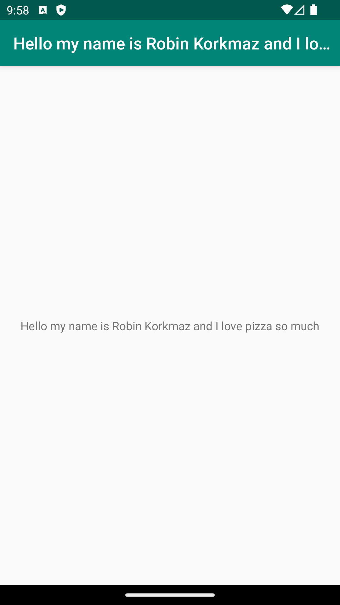

# Rapport

**Skriv din rapport här!**

I min rapport har jag en screenshot på telefonens framsida samt har jag en kod på vad jag ändrade det nya namnet till.
Hur jag gick till väga var att jag först forkade och clonadet från github och la in det i Android studio senare ändrade koden. 
Sen till sist tog jag screenshot comittade och pushade sen till sist skall jag skicka rapporten till github. 



Fördel:
Fördelen var att det blev smidigt att skicka allt till github.
En annan fördel var att processen med screenshot var väldigt smidigt.

nackdel:
En nackdel var att min kod SDK crashade så var tvungen att starta om hela programmmet.


```
<resources>
    <string name="app_name">Hello my name is Robin Korkmaz and I love pizza so much</string>
</resources>

```
Förklaring till kod: 
String name används när man skall skriva "text". Sen "app-name" är variabeln och värdet i denna kod är:
"Hello my name is Robin Korkmaz and I love pizza so much".


L